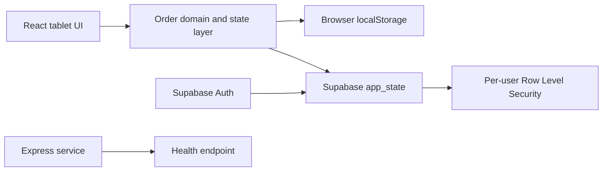

# Butcher Order Management System

A tablet-first order management application built for the daily workflow of a
working family butcher shop.

[Live application](https://butcher-order-system-fullstack.vercel.app)

## Why I built it

The shop previously relied on paper and manual coordination for phone orders,
future pickups, customer details, preparation totals, and unpaid orders. This
application brings those tasks into one focused Arabic-first interface designed
for fast use during busy service hours.

This is an actively developed product based on a real operational problem—not a
tutorial or a demo-only CRUD application.

## Features

- Create, edit, complete, and archive multi-item orders
- Schedule future pickups and automatically promote due orders
- Remember customers and find them by phone-number suffix
- Calculate order totals from a configurable price list
- Track preparation status at order and item level
- Summarize daily grill, kebab, and shawarma quantities
- Track completed, paid, and unpaid orders
- Authenticate and synchronize data with Supabase
- Continue locally when Supabase is not configured
- Convert Arabic speech into a reviewable order draft

The voice assistant never saves an order automatically. A shop worker must
review and confirm every generated draft.

## Technology

- React 19 and Vite
- React Router
- Supabase Authentication and PostgreSQL
- Row Level Security
- Material UI date/time pickers
- Browser Speech Recognition API
- Node.js and Express health service

## Architecture



The React application currently communicates directly with Supabase. The
Express service is deliberately small and only exposes health endpoints; it is
not part of the primary data path. See
[Architecture](docs/ARCHITECTURE.md) for design decisions and known tradeoffs.

## Project structure

```text
client/
  src/
    components/          Shared UI components
    context/             Application state orchestration
    data/                Menu and preparation configuration
    features/orders/     Order-domain utilities and tests
    lib/                 External service adapters
    pages/               Route-level screens
server/
  src/                   Optional Express health service
supabase/
  app_state.sql          Table definition and RLS policies
docs/
  ARCHITECTURE.md        Data flow, decisions, and limitations
```

## Run locally

### Requirements

- Node.js 20 or newer
- npm
- Optional: a Supabase project for authentication and cloud sync

### Frontend

```bash
cd client
npm install
npm run dev
```

Open `http://localhost:5173`.

Without Supabase environment variables, the application runs in local-only
mode. To enable authentication and cloud synchronization:

1. Copy `client/.env.example` to `client/.env`.
2. Add your Supabase URL and anonymous key.
3. Apply `supabase/app_state.sql` in the Supabase SQL editor.

Detailed instructions are in [Supabase setup](SUPABASE_SETUP.md).

### Health service

```bash
cd server
npm install
npm run dev
```

The health endpoint is available at `http://localhost:5000/api/health`.

## Quality checks

Run these commands from `client`:

```bash
npm run lint
npm test
npm run build
```

Pull requests run the same checks through GitHub Actions.

## Security and privacy

- Supabase Row Level Security restricts each user to their own state rows.
- Only the public Supabase anonymous key belongs in the frontend.
- Service-role keys, passwords, and `.env` files must never be committed.
- Customer and order information may also exist in browser storage when local
  fallback is enabled.

Please report security concerns using [SECURITY.md](SECURITY.md).

## Current limitations

- Cloud data is stored as per-user JSON documents rather than normalized
  relational order tables.
- Concurrent edits from several devices are last-write-wins.
- Local storage is not an offline synchronization queue.
- Speech recognition availability and Arabic accuracy depend on the browser.
- Automated coverage currently focuses on extracted domain utilities; broader
  component and end-to-end coverage is planned.

## Roadmap

- Normalize customers, orders, items, and payments in PostgreSQL
- Add role-based access for multiple shop workers
- Add conflict-safe offline synchronization
- Expand unit, component, and end-to-end test coverage
- Add operational analytics and customer notifications

## Contributing

Small, focused pull requests are welcome. Read
[CONTRIBUTING.md](CONTRIBUTING.md) before opening one.

## Author

Rayan Ibrahem — Computer Science graduate and full-stack developer
[GitHub](https://github.com/rayanib)
